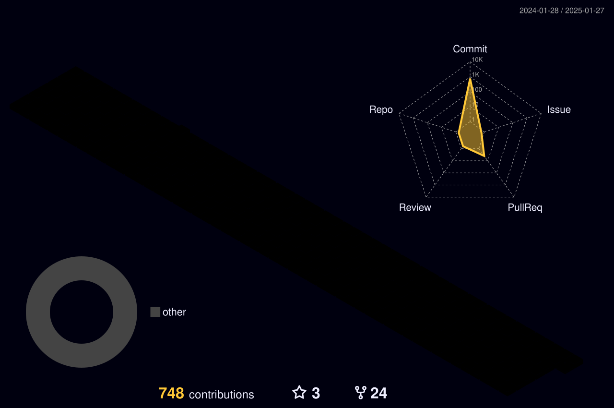

<div align="center">

# Hi 👋, I'm Hassaan Ahmad

### Full Stack AI Engineer

**Building intelligent AI agents, RAG systems & scalable full-stack applications**

<br/>

<br/>


</div>

---

## 👨‍💻 About Me

I'm a **Full Stack AI Engineer** focused on building production-ready AI systems and scalable web applications.

I specialize in **AI agents, multi-agent architectures, RAG systems, LLM integrations, and backend engineering**, primarily using Python, Django, FastAPI, LangChain and LangGraph.

On the frontend, I work with **React, Next.js, TypeScript and Tailwind CSS** to build modern interfaces around intelligent systems.

```python
hassaan = {
    "role": "Full Stack AI Engineer",
    "focus": [
        "AI Agents",
        "Multi-Agent Systems",
        "RAG",
        "LLM Applications",
        "Full Stack Development",
    ],
    "backend": ["Python", "Django", "DRF", "FastAPI"],
    "ai": ["LangGraph", "LangChain", "OpenAI", "Pinecone", "Chroma"],
    "frontend": ["React", "Next.js", "TypeScript", "Tailwind CSS"],
    "devops": ["Docker", "AWS", "Nginx", "GitHub Actions"],
}
```

---

## 🧠 AI & Agentic Engineering

My main focus is designing AI systems that go beyond simple LLM calls.

I work with:

* 🤖 **AI Agents & Multi-Agent Systems**
* 🔗 **LangGraph & LangChain**
* 📚 **Retrieval-Augmented Generation (RAG)**
* 🧩 **Model Context Protocol (MCP)**
* 🔍 **Vector Search & Semantic Retrieval**
* 🧠 **LLM Tool / Function Calling**
* 💬 **Conversational AI**
* 📄 **Document & Website Processing**
* ⚡ **Streaming AI Responses**
* 🔄 **Agent State & Workflow Orchestration**

---

## 🚀 Featured Projects

### 🤖 AI SDR Agent

Multi-agent AI system designed to research prospects and generate actionable sales intelligence.

**What it does**

* Researches prospects from multiple data sources
* Analyzes company and prospect information
* Searches relevant news and external sources
* Coordinates specialized AI agents
* Produces structured sales intelligence and pitching guides

**Tech**

`Python` · `LangGraph` · `LangChain` · `LLMs` · `Web Scraping` · `APIs`

---

### ✉️ AI Email Writer

AI-powered email generation system for creating personalized outreach and email sequences.

**Highlights**

* Personalized email generation
* Prospect-aware content
* Multi-step email sequences
* LLM-powered writing workflows
* Integrated with AI research pipelines

**Tech**

`Python` · `LangChain` · `LangGraph` · `LLMs`

---

### 🛒 Shopify AI Agent

Conversational AI shopping assistant capable of interacting with a Shopify storefront.

The agent can:

* 🔎 Search products
* 🛒 Add products to cart
* ➖ Remove products from cart
* 🔄 Update product quantities
* 📦 Retrieve cart information
* 💬 Understand conversational shopping requests

Built using a **tool-based LangGraph architecture** where specialized nodes handle different shopping operations.

**Tech**

`Python` · `LangGraph` · `Shopify GraphQL` · `LLMs` · `Tool Calling`

---

### 💬 Booosted — AI Chatbot SaaS

A SaaS platform for creating AI-powered chatbots trained on business content.

**Features**

* 🌐 Website crawling
* 📄 Document ingestion
* 🧠 Vector embeddings
* 💬 RAG-based conversations
* 👥 Lead generation
* 📊 Admin analytics
* 💳 Stripe subscriptions
* ⚙️ Background processing

**Tech**

`Django` · `DRF` · `Celery` · `Redis` · `PostgreSQL` · `Pinecone` · `Chroma` · `Stripe` · `Docker`

---

## 🛠️ Tech Stack

### 🤖 AI / LLM

<p>


</p>

### ⚙️ Backend

<p>


</p>

### 🎨 Frontend

<p>


</p>

### 🗄️ Databases & Vector Stores

<p>


</p>

### ☁️ DevOps & Cloud

<p>


</p>

---

## 🌱 Currently Exploring

```text
🧩 Model Context Protocol (MCP)
🤖 Advanced Multi-Agent Architectures
🧠 Production AI Agent Design
⚡ Scalable LLM Applications
🔍 Advanced RAG & Retrieval Systems
```

---

## 📊 GitHub Analytics

<div align="center">


</div>

<br/>

<div align="center">


</div>

---

## ⚡ Contribution Activity

<div align="center">



</div>

---
[](https://holopin.io/@hassaanahmad)

---

## 🏆 GitHub Achievements

<div align="center">


</div>

---

## 🐍 Contribution Journey

<div align="center">


</div>

---

## 👀 Profile Views

<div align="center">


</div>

---

## 🤝 Let's Connect

I'm interested in building **AI-powered products, intelligent agents and scalable full-stack systems**.

<div align="center">

[](https://www.linkedin.com/in/hassaan-ahmad-155132221/)
[](mailto:hahmad2205@gmail.com)
[](https://hassaan-ahmad.com)

</div>

<br/><br/>

### 💡 *Building intelligent systems, one agent at a time.*

</div>
