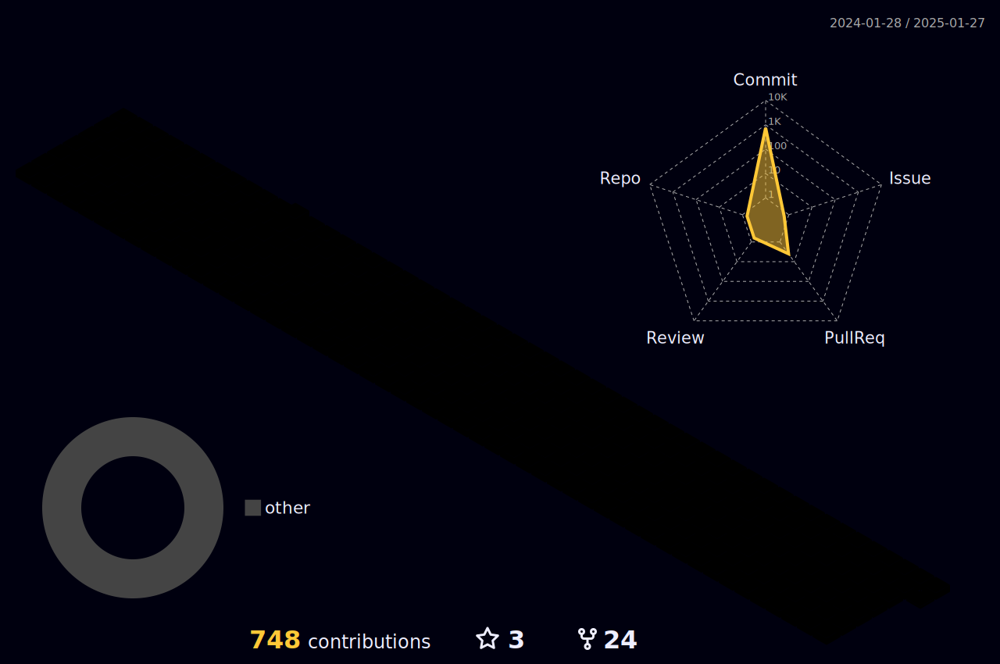

<body>

    <h1 style="color: #F7CC18FF;">Hi there, I'm Hassaan Ahmad👋</h1>
    
  

  
  

<!-- <h1 align="center"> Connect with me: </h1>

  

 -->
     

## About Me
As a highly skilled Software Engineer, I specialize in the development, and deployment of web applications, web platforms, and hybrid mobile applications. Leveraging a diverse skill set across numerous programming languages and frameworks, I deliver robust and innovative solutions that drive digital transformation and deliver on business objectives.

### Backend Expertise:
- **Web and Back-End Development**: Proficient in Python, Django, and Django REST Framework for building scalable and maintainable server-side applications.
- **Django Frameworks**: Skilled in leveraging Django's ecosystem, including Django ORM, middleware, authentication, and third-party integrations, to create efficient and secure back-end systems.
- **RESTful APIs**: Experienced in developing RESTful APIs using Django REST Framework with features like serialization, viewsets, filtering, and pagination for seamless client-server communication.

### DevOps Skills:
- **Cloud Services:** Proficient in Amazon Web Services (AWS) and Google Cloud Platform (GCP) for cloud-based solutions.
- **Containerization and Server Configuration:** Skilled in Docker and Nginx.
- **Continuous Integration:** Experienced in Jenkins and Github Actions for seamless software development and deployment.

### Database Skills:
- **Database Management:** Skilled in SQLite, MySQL, PostgreSQL, MongoDB, and DynamoDB for data management and storage.
- **Queries:** Expert in complex queries.

### DevOps Skills:
- **Cloud Services:** Proficient in Amazon Web Services (AWS) and Google Cloud Platform (GCP) for cloud-based solutions.
- **Containerization and Server Configuration:** Skilled in Docker and Nginx.
- **Continuous Integration:** Experienced in Jenkins and Github Actions for seamless software development and deployment.

### Other Skills:
- **Web Application Development:** Adept at developing robust and scalable web applications.
- **Task Management:** Skilled with Celery for distributed task queues.
- **API Integration:** Experienced in Google Maps API and Payment Gateway Integration (Stripe, Braintree).
- **Version Control:** Proficient with Jira, Git, Bitbucket, and GitHub for project management and version control.

[//]: # (### I'm a Full Stack Web Developer, Enthuist and Student!)

[//]: # (- 🔭 I’m currently working as Mern Stack Web Developer.)

[//]: # (- 🌱 I’m currently expanding my knowledge in other Web Technologies.)

[//]: # (- 👯 I’m looking to collaborate with other content creators and developers.)

[//]: # (- 🥅 2023-24 Goals: Contribute more to Open Source projects and Execute my Innovative ideas.)

[//]: # (- 💎 If you are a Tech boy/girl let's get connected.)

 
 
    
<h2> 🛠 Tech Stack</h2>

<table>
<tr>
<td align='center'>

</td>
<td align='center'>

</td>
<td align='center'>

</td>
<td align='center'>

</td>
<td align='center'>

</td>
</tr>
<tr>
<td align='center'>

</td>
<td align='center'>

</td>
<td align='center'>

</td>
<td align='center' width="200">

</td>
<td align='center' width="200">

</td>
</tr>
<tr>
<td align='center' width="200">

</td>
<td align='center' width="200">

</td>
<td align='center'>

</td>
<td align='center' width="200">

</td>
<td align='center' width="200">

</td>
</tr>
<tr>	
<td align='center' width="200">

</td>
<td align='center' width="200">

</td>
<td align='center' width="200">

</td>
<td align='center' width="200">

</td>
<td align='center' width="200">

</td>
</tr>
<tr>
<td align='center' width="200">

</td>
<td align='center' width="200">

</td>
<td align='center' width="200">

</td>
<td align='center' width="200">

</td>
<td align='center'>

</td>
</tr>
</table>
	  

 

    
 

<table>
  <tr>
    <th>Stats</th>
    <th>Streak</th>
    <th>Languages</th>
  </tr>
  <tr>
    <td></td>
    <td></td>
    <td></td>
  </tr>
</table>

## ⚡️Github Contributions

<h4 align="center">Isometric view of contributions in the last year</h4>

  

 

 
<h2 align="center">🏆 GitHub Profile Trophy:</h2>

<h2 align>Spotify Playing 🎧</h2>
    

    

 
  Views 
  

